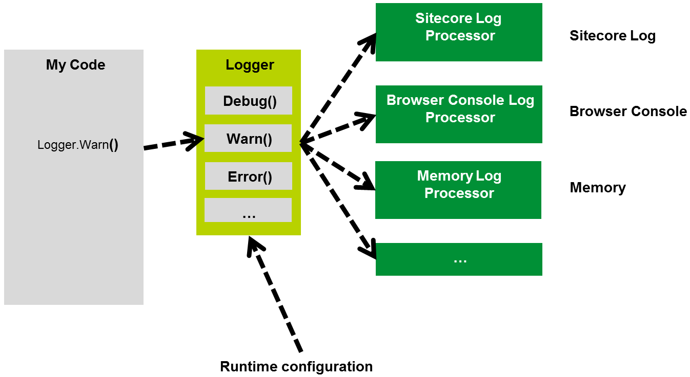
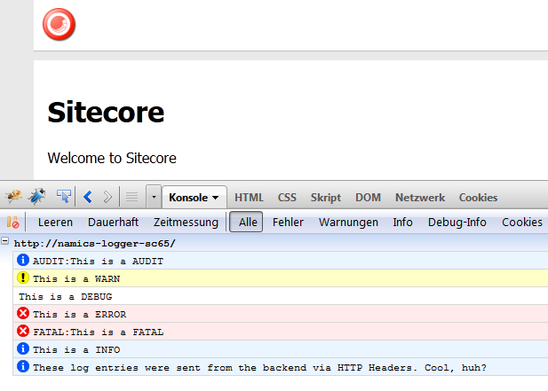

# Sitecore Logger

The Logger Module provides a set of static methods to use for logging. I.E. Logger.Error("Error message"). The class will dynamically invoke processors which will write log entries to a specific target. I.E. you can enable the SitecoreLogProcessor to write to the standard Sitecore log. You can easily implement own processors.

Configuration of the logger is done via config file. Also, a config item can be used to allow configuration changes at runtime.



##Usage
Usage is very simple. Just use one of Logger's static methods to log an event.

`Namics.Foundation.Logger.Logger.Warn("Some warning");`

# Installation Guide
To set up the module, follow these steps:
1. Install the logger package using the Sitecore Installation Wizard
1. Configure Logging and Processors in the `/App_Config/Include/Namics.Logger.config`

To set up the runtime configuration item:
1. Create a new Item inheriting the `/sitecore/templates/Modules/Namics Logger/Namics Logger Config Template`
1. Set the path of the newly created item in Namics.Logger.config in the setting `Namics.Debug.ConfigItemPath`

# Configuration
The following configuration options are available:

Setting | Example Value | Description
------------ | ------------- | -------------
Namics.Debug.ConfigItemPath | /sitecore/system/Modules/Namics Logger/Logger Config | Path to the configuration item. If empty or if the item doesn't exist, the config file is used as fallback
Namics.Debug.LogLevel | 	* NONE * AUDIT * FATAL * ERROR * WARN * INFO * DEBUG | Sets the log level. DEBUG will log all messages while NONE won't log any messages at all.
Namics.Debug.LogProcessors | e.g. MyNamespace.MyClass \| MyNamespace.MyOtherClass | List of processor class names separated by a pipe | character. Each processor receives log entries and outputs them to a specific target.
Namics.Debug.Console.AllowedIp | 127.0.0.1 \| 192.168.1.100 \| 10.0. \| 10.1. | List of IP prefixes. The prefix of the user's IP needs to match to enable browser console logging via HTTP Headers. Use "ALL" as value to enable logging for all IPs.

The database for the database logger can be configured in the ConnectionStrings config, e.g.:

```xml
<connectionStrings>
  <!-- Other connection strings -->
  <add name="DatabaseLog" connectionString="user id=MyDatabaseUser;password=MyPassword;Data Source=MyDatabaseServer;Database=MyDatabaseName;"/>
</connectionStrings>
```

Note:
If you use an older version, please replace `Namics.Foundation.Logger` to `Namics.Opensource.Modules.Logger`. We've changed the Namespace in one of the latest releases to be closer to the technical parlance of HELIX.

## Log Processors

### Included in Namics Logger

Title | Fully qualified class name | Description
------------ | ------------- | -------------
SitecoreLogProcessor | Namics.Foundation.Logger. Processors.SitecoreLog.SitecoreLogProcessor | Writes log entries to the standard sitecore log.
BrowserConsoleLogProcessor | Namics.Foundation.Logger. Processors.BrowserConsoleLog. | Writes log entries to the browser console log using HTTP headers (FirePHP protocol) if the user's IP matches the configured IP prefix. Refer to FirePHP for details. If your server is behind an application firewall, you might need to enable the HTTP headers as described in the FirePHP Reference.
MemoryLogProcessor | Namics.Foundation.Logger. Processors.MemoryLog.MemoryLogProcessor | Writes log entries to a static collection in memory. The log entry collection can be accessed via MemoryLogProcessor.Entries and can be cleared using MemoryLogProcessor.Clear(). Caution: log entries of all threads are written into the collection simultaneously. It is not recommended to use this processor in production.
DatabaseLogProcessor | Namics.Foundation.Logger. Processors.DatabaseLog.DatabaseLogProcessor | Writes log entries to the configured SQL database. The database is configured using the Sitecore ConnectionString config by adding an entry with the name 'DatabaseLog'. If it doesn't already exist, the module will create a table also called 'DatabaseLog' for you.

### Implement an own Log Processor
To implement an own Log Processor, simply implement the Namics.Foundation.Logger.Processors.ILogProcessor interface and add the fully qualified name of your class to the BrowserConsoleLogProcessor list in config.

```csharp
public class OwnLogger : Namics.Foundation.Logger.Processors.ILogProcessor
    {
        /// <summary>
        /// Processes a log entry.
        /// </summary>
        /// <param name="pEntry">
        /// The log entry object
        /// </param>
        public void WriteLogEntry(LogEntry pEntry)
        {
            // Do something with the log entry here
        }
    }
```

## Displaying Browser Console Log Messages in Chrome or Firefox

### Firefox
Install Firebug and the FirePHP addon. That's all.

### Chrome
Install the [FirePHP4Chrome Extension](https://chrome.google.com/webstore/detail/firephp4chrome/gpgbmonepdpnacijbbdijfbecmgoojma).

### Screenshots
